<!DOCTYPE html>
<html lang="pt-BR">
<head>
  <meta charset="UTF-8">
  <meta name="viewport" content="width=device-width, initial-scale=1.0">
  <meta name="description" content="Transforme sua impressora 3D em uma máquina de vendas com mais de 150 mil modelos prontos para imprimir.">
  <title>PACK 3D - +150.000 Modelos 3D</title>
  <link rel="icon" href="images/favicon.ico" type="image/x-icon" sizes="16x16">
  <link rel="preconnect" href="https://fonts.gstatic.com" crossorigin>
  <link rel="stylesheet" href="style.css">
  <!-- Preload first image -->
  <link rel="preload" as="image" href="images/imgi_1_KQNPeWB-D9d9-B09.webp" fetchpriority="high">
</head>
<body>

<!-- ============================================================
     HEADER
     ============================================================ -->
<header class="site-header">
  

    

      <svg xmlns="http://www.w3.org/2000/svg" width="24" height="24" viewBox="0 0 24 24" fill="none" stroke="currentColor" stroke-width="2" stroke-linecap="round" stroke-linejoin="round" aria-hidden="true">
        <path d="M11 21.73a2 2 0 0 0 2 0l7-4A2 2 0 0 0 21 16V8a2 2 0 0 0-1-1.73l-7-4a2 2 0 0 0-2 0l-7 4A2 2 0 0 0 3 8v8a2 2 0 0 0 1 1.73z"/>
        <path d="M12 22V12"/>
        <polyline points="3.29 7 12 12 20.71 7"/>
        <path d="m7.5 4.27 9 5.15"/>
      </svg>
    

    PACK 3D
  

</header>

<!-- ============================================================
     HERO SECTION
     ============================================================ -->
<section class="hero">
  

    <!-- Timer -->
    

      <svg xmlns="http://www.w3.org/2000/svg" width="24" height="24" viewBox="0 0 24 24" fill="none" stroke="currentColor" stroke-width="2" stroke-linecap="round" stroke-linejoin="round" aria-hidden="true">
        <circle cx="12" cy="12" r="10"/><polyline points="12 6 12 12 16 14"/>
      </svg>
      Oferta expira em:
      15:00
    

    <!-- Title -->
    <h1 class="hero-title reveal">
      A MAIOR COLEÇÃO DE MODELOS 3D COM +150.000 ARQUIVOS PRONTOS
    </h1>

    <!-- VSL -->
    

      

        <!-- COLE AQUI O SCRIPT DA VTURB -->
        

          <svg xmlns="http://www.w3.org/2000/svg" width="24" height="24" viewBox="0 0 24 24" fill="none" stroke="currentColor" stroke-width="2" stroke-linecap="round" stroke-linejoin="round" aria-hidden="true">
            <polygon points="5 3 19 12 5 21 5 3"/>
          </svg>
          PACK 3D Digital Maker
        

      

    

    <!-- Subtitle -->
    
Acesse um acervo completo, organizado por categorias, com milhares de modelos prontos para imprimir.

    
Arquivos testados, organizados e prontos para uso imediato

    <!-- CTA -->
    

      

        <button class="btn btn-primary btn-lg btn-full" data-checkout="#checkout">
          ACESSAR AGORA
          <svg class="btn-arrow" xmlns="http://www.w3.org/2000/svg" width="24" height="24" viewBox="0 0 24 24" fill="none" stroke="currentColor" stroke-width="2" stroke-linecap="round" stroke-linejoin="round" aria-hidden="true">
            <path d="m9 18 6-6-6-6"/>
          </svg>
        </button>
        
Acesso imediato e vitalício

      

    

    <!-- Checkmarks -->
    

      
✔ Sem precisar modelar

      
✔ Pronto para vender

      
✔ Acesso imediato

    

  

</section>

<!-- ============================================================
     PAIN SECTION
     ============================================================ -->
<section class="pain-section">
  

    <h2 class="section-title reveal">SUA IMPRESSORA ESTÁ GANHANDO DINHEIRO OU JUNTANDO POEIRA?</h2>
    

      

        ❌
        Impressora parada por falta de demanda
      

      

        ❌
        Sem ideias lucrativas do que vender
      

      

        ❌
        Perdendo tempo com arquivos quebrados
      

    

    
"Um acervo completo para você imprimir sem perder tempo."

  

</section>

<!-- ============================================================
     STEPS SECTION
     ============================================================ -->
<section class="steps-section">
  

    
O CAMINHO É SIMPLES:

    
Você só precisa baixar, imprimir e vender.

    

      

        

          <svg xmlns="http://www.w3.org/2000/svg" width="24" height="24" viewBox="0 0 24 24" fill="none" stroke="currentColor" stroke-width="2" stroke-linecap="round" stroke-linejoin="round" aria-hidden="true">
            <path d="M21 15v4a2 2 0 0 1-2 2H5a2 2 0 0 1-2-2v-4"/>
            <polyline points="7 10 12 15 17 10"/>
            <line x1="12" x2="12" y1="15" y2="3"/>
          </svg>
        

        Escolha e baixe
      

      

        

          <svg xmlns="http://www.w3.org/2000/svg" width="24" height="24" viewBox="0 0 24 24" fill="none" stroke="currentColor" stroke-width="2" stroke-linecap="round" stroke-linejoin="round" aria-hidden="true">
            <path d="M6 18H4a2 2 0 0 1-2-2v-5a2 2 0 0 1 2-2h16a2 2 0 0 1 2 2v5a2 2 0 0 1-2 2h-2"/>
            <path d="M6 9V3a1 1 0 0 1 1-1h10a1 1 0 0 1 1 1v6"/>
            <rect height="8" rx="1" width="12" x="6" y="14"/>
          </svg>
        

        Imprima sem erros
      

      

        

          <svg xmlns="http://www.w3.org/2000/svg" width="24" height="24" viewBox="0 0 24 24" fill="none" stroke="currentColor" stroke-width="2" stroke-linecap="round" stroke-linejoin="round" aria-hidden="true">
            <path d="M6 2 3 6v14a2 2 0 0 0 2 2h14a2 2 0 0 0 2-2V6l-3-4Z"/>
            <path d="M3 6h18"/>
            <path d="M16 10a4 4 0 0 1-8 0"/>
          </svg>
        

        Lucro no bolso
      

    

  

</section>

<!-- ============================================================
     WHY SECTION
     ============================================================ -->
<section class="section-bg-white">
  

    

      <h2 class="section-title">POR QUE INVESTIR NESTE ACERVO?</h2>
      

    

    

      

        
💡

        <h3>Ideias infinitas</h3>
        
Nunca mais fique sem saber o que imprimir para seus clientes.

      

      

        
⚡

        <h3>Mais tempo livre</h3>
        
Pule a etapa cansativa e demorada da modelagem 3D.

      

      

        
📦

        <h3>Produtos que vendem</h3>
        
Foque em modelos que possuem alta demanda de mercado.

      

      

        
💰

        <h3>Máximo Lucro</h3>
        
Custo por arquivo irrisório, potencializando sua margem.

      

    

  

</section>

<!-- ============================================================
     CATEGORIES CAROUSEL
     ============================================================ -->
<section class="categories-section">
  

    

      <h2 class="section-title">CATEGORIAS DO ACERVO</h2>
      
Milhares de arquivos organizados para facilitar seu trabalho

    

    

      

        

          

            

              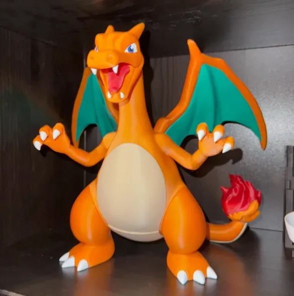
              
Animes

            

          

          

            

              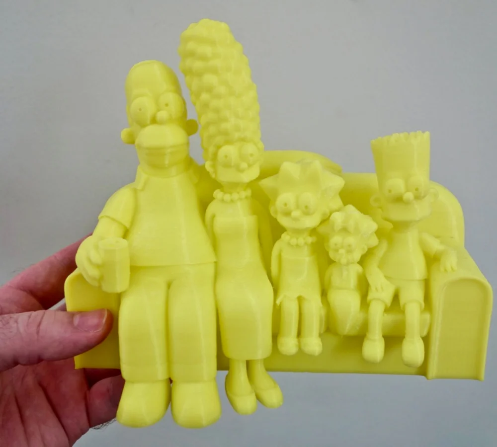
              
Desenhos

            

          

          

            

              
              
Religião

            

          

          

            

              
              
Mitologia

            

          

          

            

              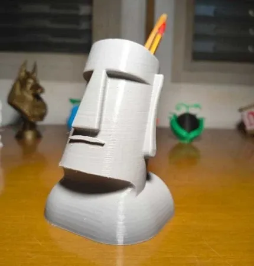
              
Decoração

            

          

        

      

      <button class="carousel-btn carousel-prev" id="cat-prev" aria-label="Slide anterior">
        <svg xmlns="http://www.w3.org/2000/svg" width="24" height="24" viewBox="0 0 24 24" fill="none" stroke="currentColor" stroke-width="2" stroke-linecap="round" stroke-linejoin="round" aria-hidden="true">
          <path d="m15 18-6-6 6-6"/>
        </svg>
      </button>
      <button class="carousel-btn carousel-next" id="cat-next" aria-label="Próximo slide">
        <svg xmlns="http://www.w3.org/2000/svg" width="24" height="24" viewBox="0 0 24 24" fill="none" stroke="currentColor" stroke-width="2" stroke-linecap="round" stroke-linejoin="round" aria-hidden="true">
          <path d="m9 18 6-6-6-6"/>
        </svg>
      </button>
    

  

</section>

<!-- ============================================================
     COMPARE SECTION
     ============================================================ -->
<section class="section-bg-white">
  

    

      <h2 class="section-title">A ESCOLHA É ÓBVIA</h2>
      
Compare e veja por que milhares de pessoas escolheram o nosso acervo

    

    

      

        <h3>❌ SEM O PACK 3D:</h3>
        <ul class="compare-list">
          <li>✗ Perde tempo caçando arquivos em sites e grupos</li>
          <li>✗ Encontra modelos quebrados ou incompletos</li>
          <li>✗ Paga caro por cada modelo individual</li>
          <li>✗ Fica limitado a poucos projetos</li>
          <li>✗ Risco com arquivos maliciosos</li>
        </ul>
      

      

        <h3>✅ COM O PACK 3D:</h3>
        <ul class="compare-list">
          <li>✓ Acesso instantâneo a +150 mil modelos organizados</li>
          <li>✓ Arquivos testados e prontos para fatiar</li>
          <li>✓ Economia total, pagamento único e vitalício</li>
          <li>✓ Material exclusivo com temas variados</li>
          <li>✓ Suporte completo e acervo sempre à mão</li>
        </ul>
      

    

  

</section>

<!-- ============================================================
     BONUS SECTION
     ============================================================ -->
<section class="bonus-section">
  

    

      <h2 class="section-title">COMPRE HOJE E GANHE 11 BÔNUS EXCLUSIVOS 🎁</h2>
      
Aproveite esta oferta por tempo limitado

    

    

      

        

          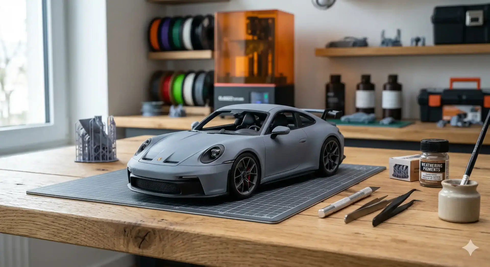
          GRÁTIS
        

        

          <h3>🎁 Bônus 1: Pack de Veículos 3D Profissionais</h3>
          
Carros, motos, caminhões e muito mais prontos para impressão 3D. Crie miniaturas detalhadas ou modelos para revenda.

        

      

      

        

          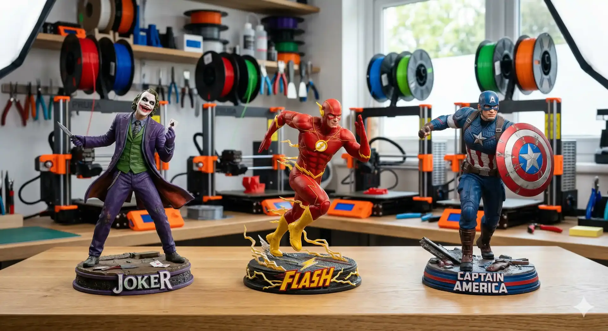
          GRÁTIS
        

        

          <h3>🎁 Bônus 2: Coleção Heróis da Marvel</h3>
          
Modelos STL de heróis lendários: personagens, símbolos e acessórios que fazem sucesso entre colecionadores.

        

      

      

        

          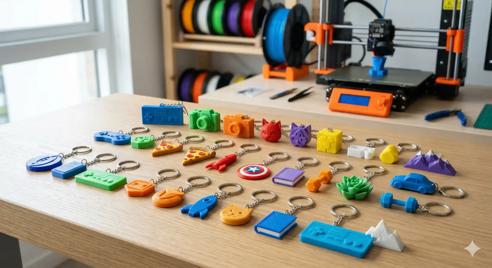
          GRÁTIS
        

        

          <h3>🎁 Bônus 3: Pack de Chaveiros Personalizados</h3>
          
Mais de 1.000 modelos criativos incluindo logos, personagens e temas geek. Perfeito para vendas rápidas.

        

      

      

        

          
          GRÁTIS
        

        

          <h3>🎁 Bônus 4: Modelos Flexíveis e Articulados</h3>
          
Mais de 1.300 modelos articulados que são febre em vendas em marketplaces e lojas físicas.

        

      

      

        

          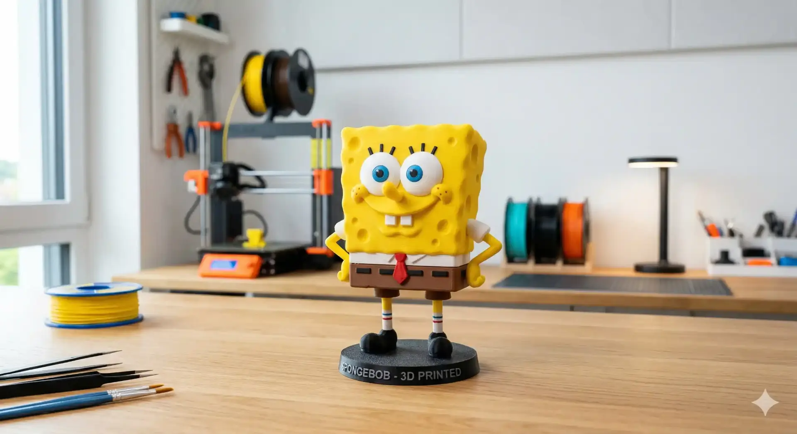
          GRÁTIS
        

        

          <h3>🎁 Bônus 5: Coleção Clássicos dos Desenhos</h3>
          
Seleção nostálgica com mais de 30 personagens icônicos da TV para fãs de todas as idades.

        

      

      

        

          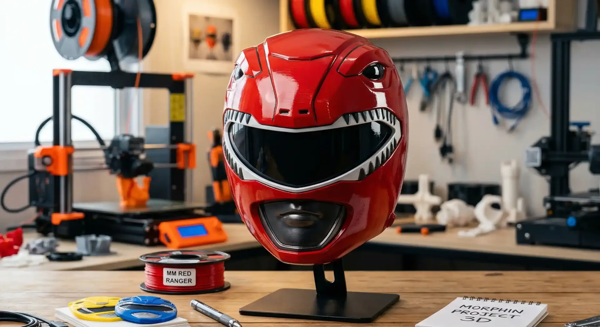
          GRÁTIS
        

        

          <h3>🎁 Bônus 6: Coleção Máscaras 3D</h3>
          
Dezenas de máscaras detalhadas para cosplay ou decoration. Peças de alto valor agregado.

        

      

      

        

          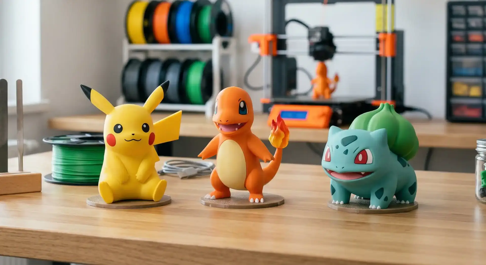
          GRÁTIS
        

        

          <h3>🎁 Bônus 7: Coleção Pokémon 3D</h3>
          
Mais de 100 modelos clássicos de Pokémon. Perfeito para colecionadores e fãs da franquia.

        

      

      

        

          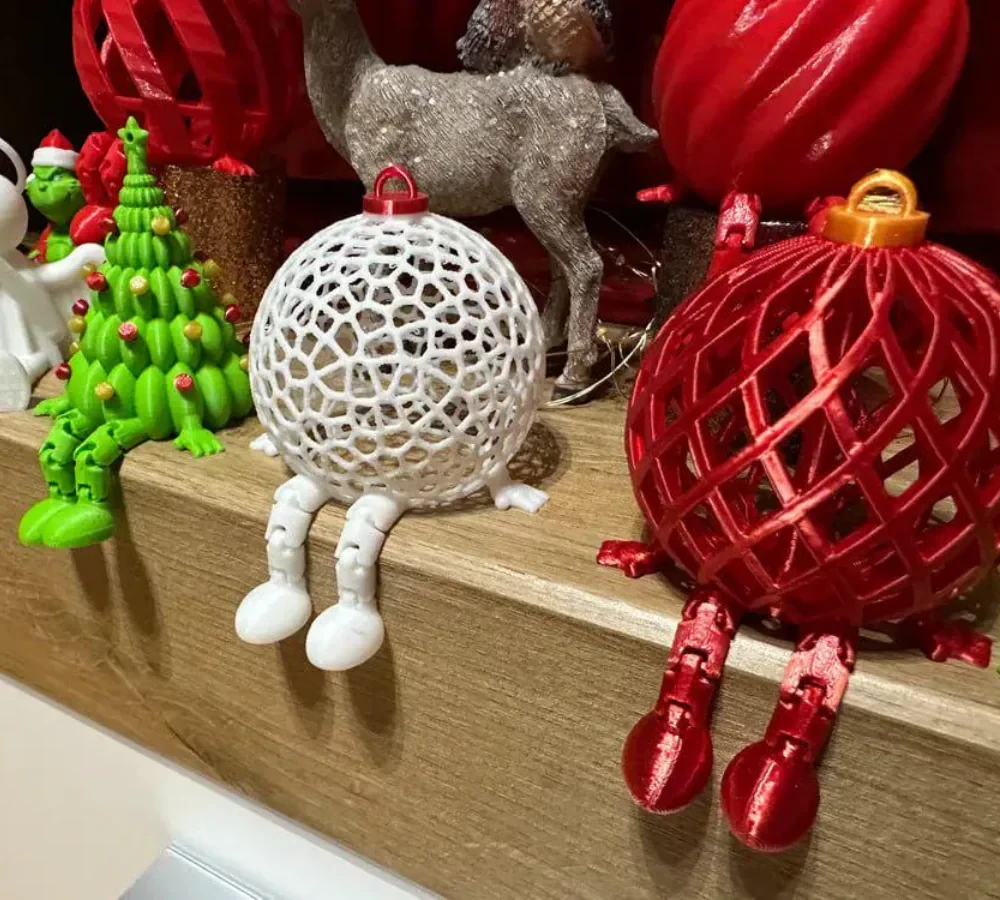
          GRÁTIS
        

        

          <h3>🎁 Bônus 8: Coleção 3D de Natal</h3>
          
Coleção exclusiva natalina para você lucrar alto na temporada de festas com decorações personalizadas.

        

      

      

        

          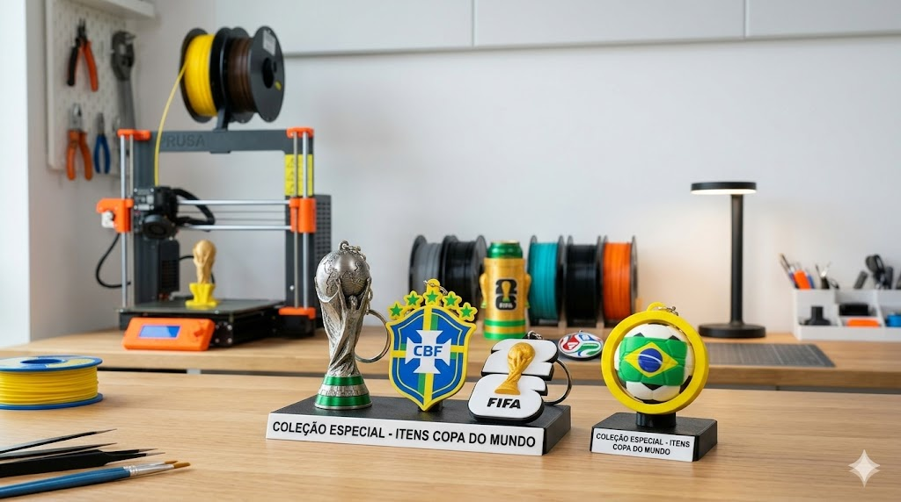
          GRÁTIS
        

        

          <h3>🎁 Bônus 9: Coleção Copa do Mundo</h3>
          
Acesso completo à nossa coleção exclusiva do Mundial 2026. Chaveiros, troféus e acessórios para lucrar nos jogos.

        

      

      

        

          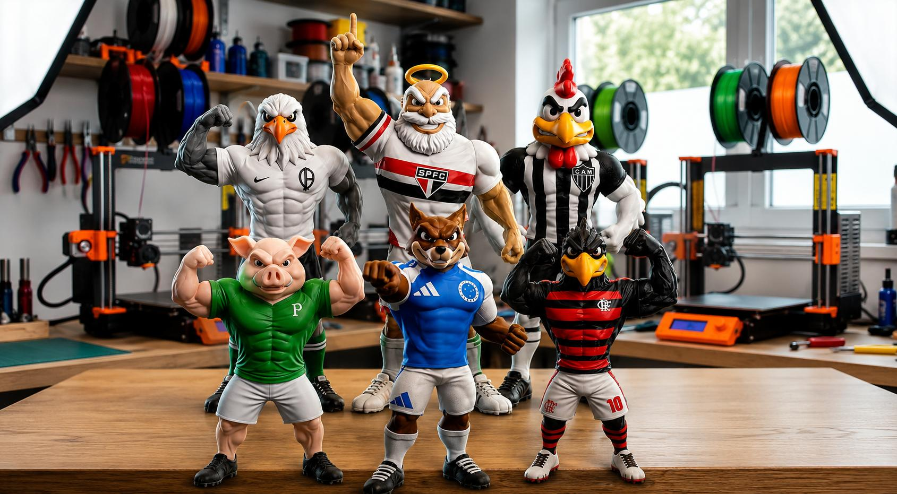
          GRÁTIS
        

        

          <h3>🎁 Bônus 10: Mascote Esportivo Exclusivos</h3>
          
Pack exclusivo com modelos de mascotes esportivos detalhados para colecionadores e torcedores.

        

      

      

        

          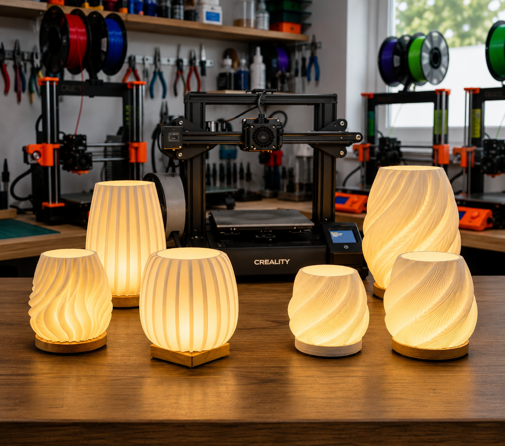
          GRÁTIS
        

        

          <h3>🎁 Bônus 11: +250 Luminárias STL</h3>
          
Coleção premium com mais de 250 modelos de luminárias, abajures e painéis decorativos prontos para fatiar.

        

      

    

    <!-- Bonus total box -->
    

      
Valor Total dos Bônus: R$ 597,10

      
HOJE: R$ 0,00

      
Disponível apenas para novos acessos hoje

    

  

</section>

<!-- ============================================================
     TESTIMONIALS CAROUSEL
     ============================================================ -->
<section class="testimonials-section">
  

    

      <h2 class="section-title">QUEM JÁ ACESSOU RECOMENDA</h2>
      
Veja o que nossos clientes estão dizendo:

    

    

      

        

          

            
          

          

            
          

          

            
          

          

            
          

          

            
          

          

            
          

          

            
          

          

            
          

          

            
          

          

            
          

          

            
          

          

            
          

        

      

      <button class="carousel-btn carousel-prev" id="test-prev" aria-label="Depoimento anterior">
        <svg xmlns="http://www.w3.org/2000/svg" width="24" height="24" viewBox="0 0 24 24" fill="none" stroke="currentColor" stroke-width="2" stroke-linecap="round" stroke-linejoin="round" aria-hidden="true">
          <path d="m15 18-6-6 6-6"/>
        </svg>
      </button>
      <button class="carousel-btn carousel-next" id="test-next" aria-label="Próximo depoimento">
        <svg xmlns="http://www.w3.org/2000/svg" width="24" height="24" viewBox="0 0 24 24" fill="none" stroke="currentColor" stroke-width="2" stroke-linecap="round" stroke-linejoin="round" aria-hidden="true">
          <path d="m9 18 6-6-6-6"/>
        </svg>
      </button>
    

  

</section>

<!-- ============================================================
     PRICING SECTION
     ============================================================ -->
<section class="pricing-section" id="pricing">
  

    

      <h2 class="section-title pricing-title">ESCOLHA SEU PLANO</h2>
      
Acesso imediato e vitalício. Sem mensalidades.

    

    

      <!-- PLANO BÁSICO -->
      

        
PLANO INICIANTE

        

          

            R$ 10,00
            à vista
          

        

        <ul class="plan-features">
          <li class="plan-feature">
            <svg xmlns="http://www.w3.org/2000/svg" width="24" height="24" viewBox="0 0 24 24" fill="none" stroke="currentColor" stroke-width="2" stroke-linecap="round" stroke-linejoin="round" aria-hidden="true"><path d="M20 6 9 17l-5-5"/></svg>
            Pack com +150.000 arquivos STL
          </li>
          <li class="plan-feature">
            <svg xmlns="http://www.w3.org/2000/svg" width="24" height="24" viewBox="0 0 24 24" fill="none" stroke="currentColor" stroke-width="2" stroke-linecap="round" stroke-linejoin="round" aria-hidden="true"><path d="M20 6 9 17l-5-5"/></svg>
            Acesso vitalício
          </li>
        </ul>
        <button class="btn btn-primary btn-lg btn-full" id="btn-basic">
          BAIXAR INICIANTE
        </button>
      

      <!-- PLANO PREMIUM -->
      

        

          <svg xmlns="http://www.w3.org/2000/svg" width="24" height="24" viewBox="0 0 24 24" fill="none" stroke="currentColor" stroke-width="2" stroke-linecap="round" stroke-linejoin="round" aria-hidden="true">
            <path d="M8.5 14.5A2.5 2.5 0 0 0 11 12c0-1.38-.5-2-1-3-1.072-2.143-.224-4.054 2-6 .5 2.5 2 4.9 4 6.5 2 1.6 3 3.5 3 5.5a7 7 0 1 1-14 0c0-1.153.433-2.294 1-3a2.5 2.5 0 0 0 2.5 2.5z"/>
          </svg>
          MAIS VENDIDO 🔥
        

        
MEGA PACK PREMIUM

        

          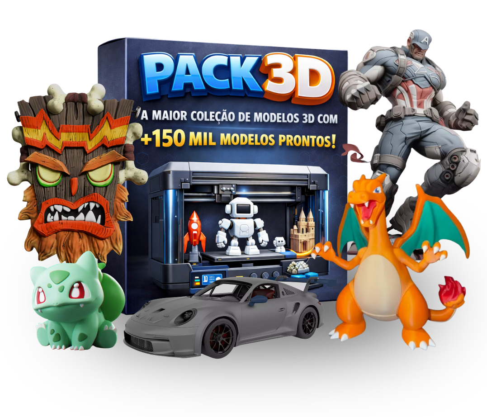
        

        

          
De R$ 197,00

          
Apenas 3x de R$ 13,97

          

            ou
            R$ 39,90
            à vista
          

        

        <ul class="plan-features">
          <li class="plan-feature">
            <svg xmlns="http://www.w3.org/2000/svg" width="24" height="24" viewBox="0 0 24 24" fill="none" stroke="currentColor" stroke-width="2" stroke-linecap="round" stroke-linejoin="round" aria-hidden="true"><path d="M20 6 9 17l-5-5"/></svg>
            Pack com +150.000 arquivos STL
          </li>
          <li class="plan-feature">
            <svg xmlns="http://www.w3.org/2000/svg" width="24" height="24" viewBox="0 0 24 24" fill="none" stroke="currentColor" stroke-width="2" stroke-linecap="round" stroke-linejoin="round" aria-hidden="true"><path d="M20 6 9 17l-5-5"/></svg>
            Acesso vitalício
          </li>
          <li class="plan-feature">
            <svg xmlns="http://www.w3.org/2000/svg" width="24" height="24" viewBox="0 0 24 24" fill="none" stroke="currentColor" stroke-width="2" stroke-linecap="round" stroke-linejoin="round" aria-hidden="true"><path d="M20 6 9 17l-5-5"/></svg>
            Bônus 1: Pack de Veículos 3D Profissionais
          </li>
          <li class="plan-feature">
            <svg xmlns="http://www.w3.org/2000/svg" width="24" height="24" viewBox="0 0 24 24" fill="none" stroke="currentColor" stroke-width="2" stroke-linecap="round" stroke-linejoin="round" aria-hidden="true"><path d="M20 6 9 17l-5-5"/></svg>
            Bônus 2: Coleção Heróis da Marvel
          </li>
          <li class="plan-feature">
            <svg xmlns="http://www.w3.org/2000/svg" width="24" height="24" viewBox="0 0 24 24" fill="none" stroke="currentColor" stroke-width="2" stroke-linecap="round" stroke-linejoin="round" aria-hidden="true"><path d="M20 6 9 17l-5-5"/></svg>
            Bônus 3: Pack de Chaveiros Personalizados
          </li>
          <li class="plan-feature">
            <svg xmlns="http://www.w3.org/2000/svg" width="24" height="24" viewBox="0 0 24 24" fill="none" stroke="currentColor" stroke-width="2" stroke-linecap="round" stroke-linejoin="round" aria-hidden="true"><path d="M20 6 9 17l-5-5"/></svg>
            Bônus 4: Modelos Flexíveis e Articulados
          </li>
          <li class="plan-feature">
            <svg xmlns="http://www.w3.org/2000/svg" width="24" height="24" viewBox="0 0 24 24" fill="none" stroke="currentColor" stroke-width="2" stroke-linecap="round" stroke-linejoin="round" aria-hidden="true"><path d="M20 6 9 17l-5-5"/></svg>
            Bônus 5: Coleção Clássicos dos Desenhos
          </li>
          <li class="plan-feature">
            <svg xmlns="http://www.w3.org/2000/svg" width="24" height="24" viewBox="0 0 24 24" fill="none" stroke="currentColor" stroke-width="2" stroke-linecap="round" stroke-linejoin="round" aria-hidden="true"><path d="M20 6 9 17l-5-5"/></svg>
            Bônus 6: Coleção Máscaras 3D
          </li>
          <li class="plan-feature">
            <svg xmlns="http://www.w3.org/2000/svg" width="24" height="24" viewBox="0 0 24 24" fill="none" stroke="currentColor" stroke-width="2" stroke-linecap="round" stroke-linejoin="round" aria-hidden="true"><path d="M20 6 9 17l-5-5"/></svg>
            Bônus 7: Coleção Pokémon 3D
          </li>
          <li class="plan-feature">
            <svg xmlns="http://www.w3.org/2000/svg" width="24" height="24" viewBox="0 0 24 24" fill="none" stroke="currentColor" stroke-width="2" stroke-linecap="round" stroke-linejoin="round" aria-hidden="true"><path d="M20 6 9 17l-5-5"/></svg>
            Bônus 8: Coleção 3D de Natal
          </li>
          <li class="plan-feature">
            <svg xmlns="http://www.w3.org/2000/svg" width="24" height="24" viewBox="0 0 24 24" fill="none" stroke="currentColor" stroke-width="2" stroke-linecap="round" stroke-linejoin="round" aria-hidden="true"><path d="M20 6 9 17l-5-5"/></svg>
            Bônus 9: Coleção Copa do Mundo
          </li>
          <li class="plan-feature">
            <svg xmlns="http://www.w3.org/2000/svg" width="24" height="24" viewBox="0 0 24 24" fill="none" stroke="currentColor" stroke-width="2" stroke-linecap="round" stroke-linejoin="round" aria-hidden="true"><path d="M20 6 9 17l-5-5"/></svg>
            Bônus 10: Mascote Esportivo Exclusivos
          </li>
          <li class="plan-feature">
            <svg xmlns="http://www.w3.org/2000/svg" width="24" height="24" viewBox="0 0 24 24" fill="none" stroke="currentColor" stroke-width="2" stroke-linecap="round" stroke-linejoin="round" aria-hidden="true"><path d="M20 6 9 17l-5-5"/></svg>
            Bônus 11: +250 Luminárias STL
          </li>
          <li class="plan-feature">
            <svg xmlns="http://www.w3.org/2000/svg" width="24" height="24" viewBox="0 0 24 24" fill="none" stroke="currentColor" stroke-width="2" stroke-linecap="round" stroke-linejoin="round" aria-hidden="true"><path d="M20 6 9 17l-5-5"/></svg>
            Bônus 12: Grupo de NETWORK
          </li>
        </ul>
        

          <button class="btn btn-green btn-lg btn-full" data-checkout="#checkout-premium">
            QUERO ESSE AGORA
            <svg class="btn-arrow" xmlns="http://www.w3.org/2000/svg" width="24" height="24" viewBox="0 0 24 24" fill="none" stroke="currentColor" stroke-width="2" stroke-linecap="round" stroke-linejoin="round" aria-hidden="true">
              <path d="m9 18 6-6-6-6"/>
            </svg>
          </button>
        

      

    

    <!-- Guarantee -->
    

      
      

        <svg xmlns="http://www.w3.org/2000/svg" width="24" height="24" viewBox="0 0 24 24" fill="none" stroke="currentColor" stroke-width="2" stroke-linecap="round" stroke-linejoin="round" aria-hidden="true">
          <path d="M20 13c0 5-3.5 7.5-7.66 8.95a1 1 0 0 1-.67-.01C7.5 20.5 4 18 4 13V6a1 1 0 0 1 1-1c2 0 4.5-1.2 6.24-2.72a1.17 1.17 0 0 1 1.52 0C14.51 3.81 17 5 19 5a1 1 0 0 1 1 1z"/>
          <path d="m9 12 2 2 4-4"/>
        </svg>
        14 DIAS DE GARANTIA BLINDADA
      

      
Se por qualquer motivo você não gostar do acervo em até 14 dias, devolvemos 100% do seu investimento. Risco Zero.

    

  

</section>

<!-- ============================================================
     FAQ SECTION
     ============================================================ -->
<section class="faq-section">
  

    <h2 class="section-title reveal" style="color:var(--zinc-900)">DÚVIDAS FREQUENTES</h2>
    

      

        <button class="faq-question" aria-expanded="false">
          Funciona em qualquer impressora?
          <svg class="faq-chevron" xmlns="http://www.w3.org/2000/svg" width="24" height="24" viewBox="0 0 24 24" fill="none" stroke="currentColor" stroke-width="2" stroke-linecap="round" stroke-linejoin="round" aria-hidden="true">
            <path d="m6 9 6 6 6-6"/>
          </svg>
        </button>
        

          Sim! Os arquivos STL são universais e funcionam em qualquer impressora 3D de resina (SLA) ou filamento (FDM). Você só precisa do seu software fatiador de costume.
        

      

      

        <button class="faq-question" aria-expanded="false">
          Preciso saber modelar?
          <svg class="faq-chevron" xmlns="http://www.w3.org/2000/svg" width="24" height="24" viewBox="0 0 24 24" fill="none" stroke="currentColor" stroke-width="2" stroke-linecap="round" stroke-linejoin="round" aria-hidden="true">
            <path d="m6 9 6 6 6-6"/>
          </svg>
        </button>
        

          Absolutamente não. Esse é o grande diferencial. Você já recebe os arquivos prontos. É só baixar, fatiar e imprimir.
        

      

      

        <button class="faq-question" aria-expanded="false">
          Como eu recebo o acesso?
          <svg class="faq-chevron" xmlns="http://www.w3.org/2000/svg" width="24" height="24" viewBox="0 0 24 24" fill="none" stroke="currentColor" stroke-width="2" stroke-linecap="round" stroke-linejoin="round" aria-hidden="true">
            <path d="m6 9 6 6 6-6"/>
          </svg>
        </button>
        

          Imediatamente após a confirmação do pagamento. Você receberá um e-mail com o link de acesso para nossa plataforma exclusiva de membros.
        

      

      

        <button class="faq-question" aria-expanded="false">
          Posso vender os produtos impressos?
          <svg class="faq-chevron" xmlns="http://www.w3.org/2000/svg" width="24" height="24" viewBox="0 0 24 24" fill="none" stroke="currentColor" stroke-width="2" stroke-linecap="round" stroke-linejoin="round" aria-hidden="true">
            <path d="m6 9 6 6 6-6"/>
          </svg>
        </button>
        

          Sim, os modelos são destinados para que você possa imprimir e comercializar as peças físicas sem problemas.
        

      

      

        <button class="faq-question" aria-expanded="false">
          As atualizações são pagas?
          <svg class="faq-chevron" xmlns="http://www.w3.org/2000/svg" width="24" height="24" viewBox="0 0 24 24" fill="none" stroke="currentColor" stroke-width="2" stroke-linecap="round" stroke-linejoin="round" aria-hidden="true">
            <path d="m6 9 6 6 6-6"/>
          </svg>
        </button>
        

          No Plano Premium, todas as atualizações mensais são 100% gratuitas e vitalícias para você.
        

      

    

  

</section>

<!-- ============================================================
     FOOTER
     ============================================================ -->
<footer class="site-footer">
  

    <h2 class="footer-title reveal">NÃO DEIXE SUA IMPRESSORA PARADA</h2>
    
O risco é 100% nosso. Se você não ficar satisfeito em até 14 dias, devolvemos cada centavo. Sem burocracia.

    

      

        <button class="btn btn-primary btn-lg btn-full" data-checkout="#checkout">
          BAIXAR COM DESCONTO
          <svg class="btn-arrow" xmlns="http://www.w3.org/2000/svg" width="24" height="24" viewBox="0 0 24 24" fill="none" stroke="currentColor" stroke-width="2" stroke-linecap="round" stroke-linejoin="round" aria-hidden="true">
            <path d="m9 18 6-6-6-6"/>
          </svg>
        </button>
        
Garantia Incondicional de 14 dias

      

    

    

      

        

          <svg xmlns="http://www.w3.org/2000/svg" width="24" height="24" viewBox="0 0 24 24" fill="none" stroke="currentColor" stroke-width="2" stroke-linecap="round" stroke-linejoin="round" style="color:var(--success)" aria-hidden="true">
            <path d="M20 13c0 5-3.5 7.5-7.66 8.95a1 1 0 0 1-.67-.01C7.5 20.5 4 18 4 13V6a1 1 0 0 1 1-1c2 0 4.5-1.2 6.24-2.72a1.17 1.17 0 0 1 1.52 0C14.51 3.81 17 5 19 5a1 1 0 0 1 1 1z"/>
            <path d="m9 12 2 2 4-4"/>
          </svg>
        

        Compra 100% Segura
      

      

        

          <svg xmlns="http://www.w3.org/2000/svg" width="24" height="24" viewBox="0 0 24 24" fill="none" stroke="currentColor" stroke-width="2" stroke-linecap="round" stroke-linejoin="round" style="color:var(--primary)" aria-hidden="true">
            <rect height="11" rx="2" ry="2" width="18" x="3" y="11"/>
            <path d="M7 11V7a5 5 0 0 1 10 0v4"/>
          </svg>
        

        Dados Criptografados
      

      

        

          <svg xmlns="http://www.w3.org/2000/svg" width="24" height="24" viewBox="0 0 24 24" fill="none" stroke="currentColor" stroke-width="2" stroke-linecap="round" stroke-linejoin="round" style="color:var(--zinc-700)" aria-hidden="true">
            <rect height="14" rx="2" width="20" x="2" y="5"/>
            <line x1="2" x2="22" y1="10" y2="10"/>
          </svg>
        

        Acesso Imediato
      

    

    

      
© 2024 PACK 3D. Todos os direitos reservados.

      

        <a href="#">TERMOS DE USO</a>
        <a href="#">PRIVACIDADE</a>
      

    

  

</footer>

<!-- ============================================================
     MOBILE STICKY BAR
     ============================================================ -->

  

    <button class="btn btn-primary btn-lg btn-full" data-checkout="#checkout">
      ACESSAR AGORA
      <svg class="btn-arrow" xmlns="http://www.w3.org/2000/svg" width="24" height="24" viewBox="0 0 24 24" fill="none" stroke="currentColor" stroke-width="2" stroke-linecap="round" stroke-linejoin="round" aria-hidden="true">
        <path d="m9 18 6-6-6-6"/>
      </svg>
    </button>
  

<!-- ============================================================
     NOTIFICATION BALLOON (Balão de Compra Fake)
     ============================================================ -->

  

    

      
    

    

      
Venda Realizada

      
Beatriz Nogueira

      

        Goiânia, GO adquiriu o
         MEGA PACK PREMIUM
      

      

        <svg xmlns="http://www.w3.org/2000/svg" width="24" height="24" viewBox="0 0 24 24" fill="none" stroke="currentColor" stroke-width="2" stroke-linecap="round" stroke-linejoin="round" aria-hidden="true">
          <circle cx="12" cy="12" r="10"/><path d="m9 12 2 2 4-4"/>
        </svg>
        Acesso imediato liberado
      

    

  

<!-- ============================================================
     POPUP MODAL — Plano Básico
     ============================================================ -->

  

    <button class="modal-close" id="modal-close" aria-label="Fechar">
      <svg xmlns="http://www.w3.org/2000/svg" width="24" height="24" viewBox="0 0 24 24" fill="none" stroke="currentColor" stroke-width="2" stroke-linecap="round" stroke-linejoin="round" aria-hidden="true">
        <path d="M18 6 6 18"/><path d="m6 6 12 12"/>
      </svg>
    </button>
    <h2 class="modal-title" id="modal-title">⚠️ Atenção!</h2>
    
Você está prestes a adquirir o Plano Iniciante. Antes de continuar, veja o que você vai perder:

    

      <strong>No Plano Iniciante você NÃO recebe:</strong> 
      ✗ Os 11 bônus exclusivos (valor: R$ 597,10) 
      ✗ Atualizações mensais gratuitas e vitalícias 
      ✗ Acesso ao grupo de NETWORK exclusivo
    

    

      <button class="btn btn-green btn-lg btn-full" id="modal-upgrade">
        QUERO O PACK COMPLETO (R$ 39,90)
      </button>
      <button class="btn-outline-zinc" id="modal-confirm">
        Continuar com o Plano Básico (R$ 10,00)
      </button>
    

  

</body>
</html>
